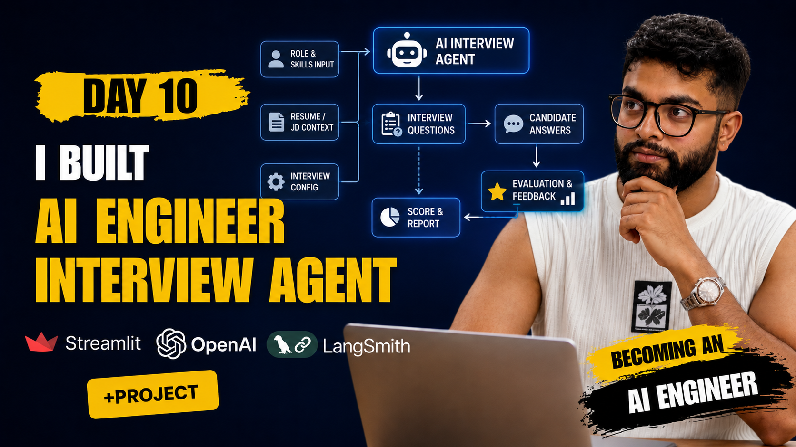

# AI Engineering Interviewer Agent

A real-time, adaptive AI interviewer for AI engineering roles. It speaks questions aloud, listens to your answers, evaluates technical depth, adjusts difficulty dynamically, and generates a full hiring report — all orchestrated by a multi-agent LangGraph pipeline with end-to-end LangSmith tracing.

> Built with OpenAI GPT-4.1 · LangGraph · LangSmith · Streamlit · Python 3.12

---

## Table of Contents

- [How It Works](#how-it-works)
- [Agents](#agents)
- [Orchestration](#orchestration)
- [Folder Structure](#folder-structure)
- [Setup](#setup)
- [Running with Streamlit](#running-with-streamlit)
- [LangSmith Tracing](#langsmith-tracing)
- [Screenshots](#screenshots)

---

## How It Works

```
User opens app
      ↓
Enter name + pick topic (RAG, Fine-tuning, Agents, etc.)
      ↓
AI generates first question via GPT-4.1
      ↓
Question is spoken aloud (OpenAI TTS)
      ↓
Candidate answers via browser mic or typed input
      ↓
Answer is transcribed (OpenAI Whisper)
      ↓
Evaluation Agent scores the answer (1–10, depth, hallucination flag)
      ↓
Difficulty Controller adjusts next question level
      ↓
Interview Agent generates next question
      ↓
Loop for up to 8 turns
      ↓
Report Agent generates final hiring signal + roadmap
```

Each step is a node in a LangGraph state machine. Every LLM call is traced in LangSmith.

---

## Agents

### 1 — Interviewer Agent
**File:** `backend/app/graph/nodes/ask_question.py`

Generates interview questions using GPT-4.1. On the first turn it produces a warm intro + opening question. On subsequent turns it reads the last answer, the evaluation summary, and the current difficulty level to decide what to ask next. Never repeats a question.

### 2 — Transcription Agent
**File:** `backend/app/audio/stt.py`

Receives audio bytes from the browser mic widget, writes them to a temp WAV file, and sends them to OpenAI Whisper (`gpt-4o-mini-transcribe`). Returns clean text.

### 3 — Evaluation Agent
**File:** `backend/app/agents/evaluator.py`

Scores each answer with a structured JSON output:

```json
{
  "score": 7,
  "depth": "intermediate",
  "missing_topics": ["HNSW", "quantization"],
  "confidence": 0.82,
  "feedback": "Good conceptual grasp, missed indexing tradeoffs.",
  "hallucinations_detected": false
}
```

Uses `response_format: json_object` to guarantee parseable output. Decorated with `@traceable` — every call appears as a named span in LangSmith.

### 4 — Difficulty Controller
**File:** `backend/app/agents/difficulty_controller.py`

Reads the last 2–3 evaluation scores and calls GPT-4.1 to decide the next difficulty level:

| Rule | Outcome |
|---|---|
| Last 2 scores ≥ 8 | Increase to **hard** |
| Last 2 scores ≤ 4 | Drop to **easy** |
| Last score 5–7 | Stay **medium** |

Returns one word: `easy`, `medium`, or `hard`.

### 5 — Report Generator
**File:** `backend/app/agents/report_generator.py`

Reads the full transcript and all evaluation scores to produce a structured markdown report with:

- Overall score (weighted average)
- Technical depth assessment
- Communication score
- Strengths and gaps (bullet points)
- **Hiring signal**: Strong Yes / Yes / Maybe / No
- Recommended study areas with resources

---

## Orchestration

LangGraph compiles a `StateGraph` that manages `InterviewState` across all nodes. State is a typed dict — fields like `transcript` and `evaluation_scores` accumulate across turns.

```
START
  └─▶ ask_question_node
          └─▶ transcription_node
                  └─▶ evaluation_node
                          ├─▶ [turn < 8] ──▶ ask_question_node  (loop)
                          └─▶ [turn ≥ 8] ──▶ report_node ──▶ END
```

The conditional edge at `evaluation_node` checks `turn_count` and `should_end`. The Streamlit frontend drives this graph node-by-node (not as a single blocking `.invoke()`) so each step can update the UI in real time.

**State shape:**

```python
class InterviewState(TypedDict):
    candidate_name: str
    transcript: list[dict]        # appended each turn
    current_question: str
    questions_asked: list[str]
    evaluation_scores: list[EvaluationResult]  # appended each turn
    interview_stage: str          # intro | technical | complete
    difficulty: str               # easy | medium | hard
    topic: str
    turn_count: int
    should_end: bool
    final_report: str
    audio_path: str | None
```

---

## Folder Structure

```
ai-interviewer-agent/
│
├── backend/
│   └── app/
│       ├── agents/
│       │   ├── difficulty_controller.py   # adjusts easy/medium/hard
│       │   ├── evaluator.py               # scores each answer
│       │   └── report_generator.py        # final hiring report
│       │
│       ├── audio/
│       │   ├── stt.py                     # Whisper transcription
│       │   └── tts.py                     # OpenAI TTS speech output
│       │
│       ├── graph/
│       │   ├── nodes/
│       │   │   ├── ask_question.py        # interviewer node
│       │   │   ├── evaluate.py            # evaluation node
│       │   │   ├── report.py              # report node
│       │   │   └── transcribe.py          # transcription node
│       │   ├── state.py                   # initial state factory
│       │   └── workflow.py                # LangGraph compiled graph
│       │
│       ├── prompts/
│       │   └── interviewer.py             # all LLM prompts
│       │
│       ├── schemas/
│       │   └── interview.py               # InterviewState + EvaluationResult
│       │
│       └── main.py                        # FastAPI REST API (optional)
│
├── backend/tests/
│   └── test_smoke.py
│
├── frontend/
│   └── app.py                             # Streamlit UI
│
├── .env.example
├── pyproject.toml
└── README.md
```

---

## Setup

### Prerequisites

- Python 3.12+
- [`uv`](https://github.com/astral-sh/uv) package manager
- OpenAI API key
- LangSmith API key (free tier works)

### Install

```bash
git clone <your-repo-url>
cd ai-interviewer-agent

# Install all dependencies
uv sync
```

### Configure environment

```bash
cp .env.example .env
```

Open `.env` and fill in:

```env
OPENAI_API_KEY=sk-...
LANGSMITH_API_KEY=lsv2_...
LANGSMITH_PROJECT=ai-interviewer-agent
LANGSMITH_TRACING=true
LANGSMITH_ENDPOINT=https://api.smith.langchain.com
```

---

## Running with Streamlit

```bash
PYTHONPATH=. uv run streamlit run frontend/app.py
```

Opens at `http://localhost:8501`.

**Interview flow:**

1. Enter your name and pick a topic
2. Click **Start Interview** — AI speaks the first question
3. Click the mic button to record your answer, or switch to the **Type** tab
4. Submit — answer is transcribed, evaluated, and the next question is generated
5. After 8 turns (or early exit) the full report is generated
6. Download the report as Markdown

---

## LangSmith Tracing

Every interview session is fully traced. Go to [smith.langchain.com](https://smith.langchain.com) → project `ai-interviewer-agent`.

### What gets traced

| Span | Type | Contents |
|---|---|---|
| `interview-session` | chain | Full session. Metadata: candidate name, topic |
| `evaluate-turn` | chain | Per-turn wrapper. Metadata: turn number, difficulty |
| `ask_question` | chain | Prompt sent + question generated |
| `evaluate_answer` | llm | Question, answer, full score JSON |
| `compute_next_difficulty` | chain | Score history → difficulty decision |
| `generate_report` | chain | Full transcript + evaluations → report |

### What to look for

- **Latency per node** — identify slow agents
- **Token usage** — monitor cost per session
- **Hallucination flag** — filter runs where `hallucinations_detected: true`
- **Score distribution** — track difficulty progression across turns
- **Prompt versions** — compare output quality across prompt edits

### Screenshot

> _(Add LangSmith trace screenshot here)_

---

## Screenshots

### Setup Screen — Enter name and pick topic
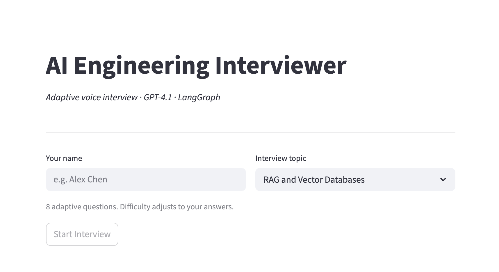

### Setup Screen — Ready to start
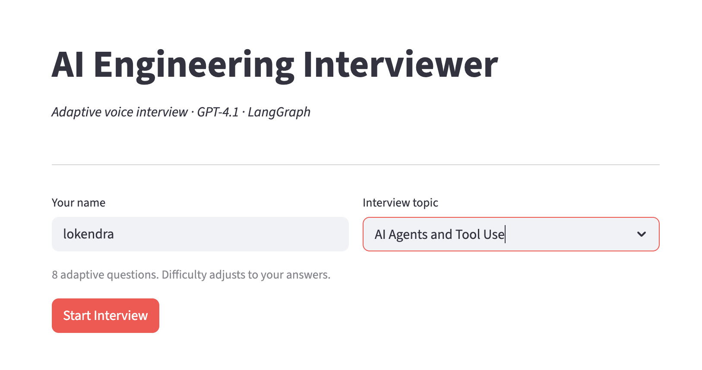

### Interview — First question asked aloud (Turn 1/8)
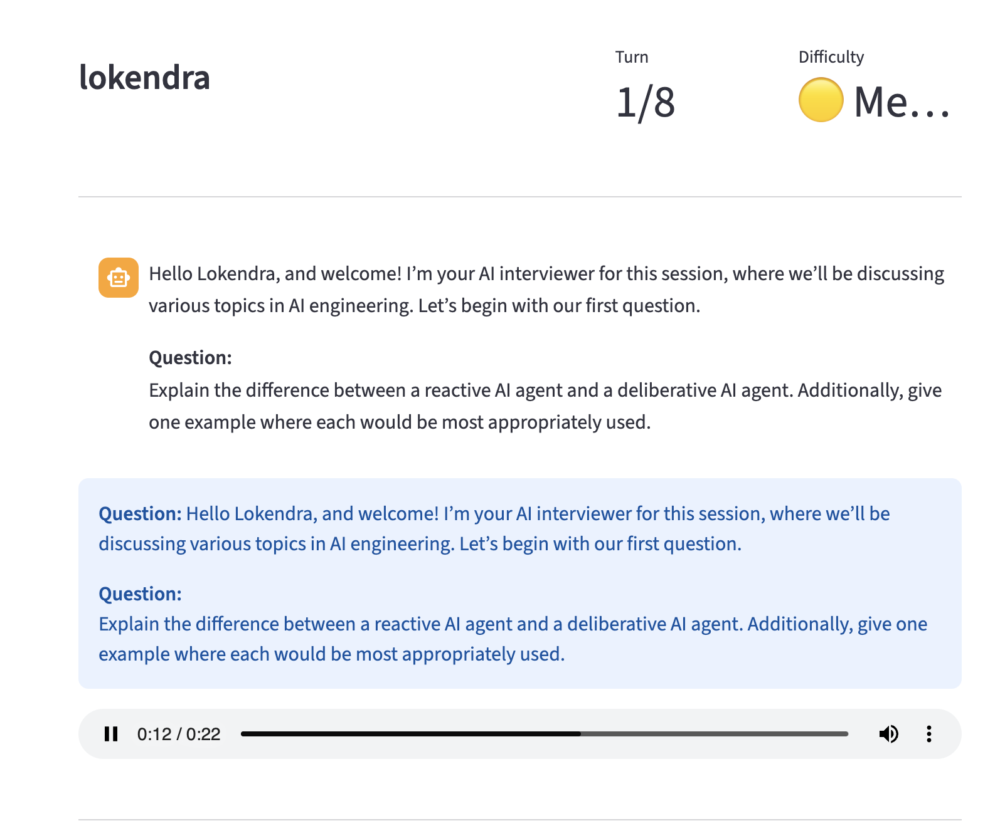

### Interview — Voice recording in progress
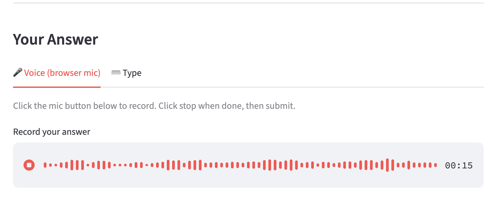

### Interview — Score history after first answer (Turn 2/8)
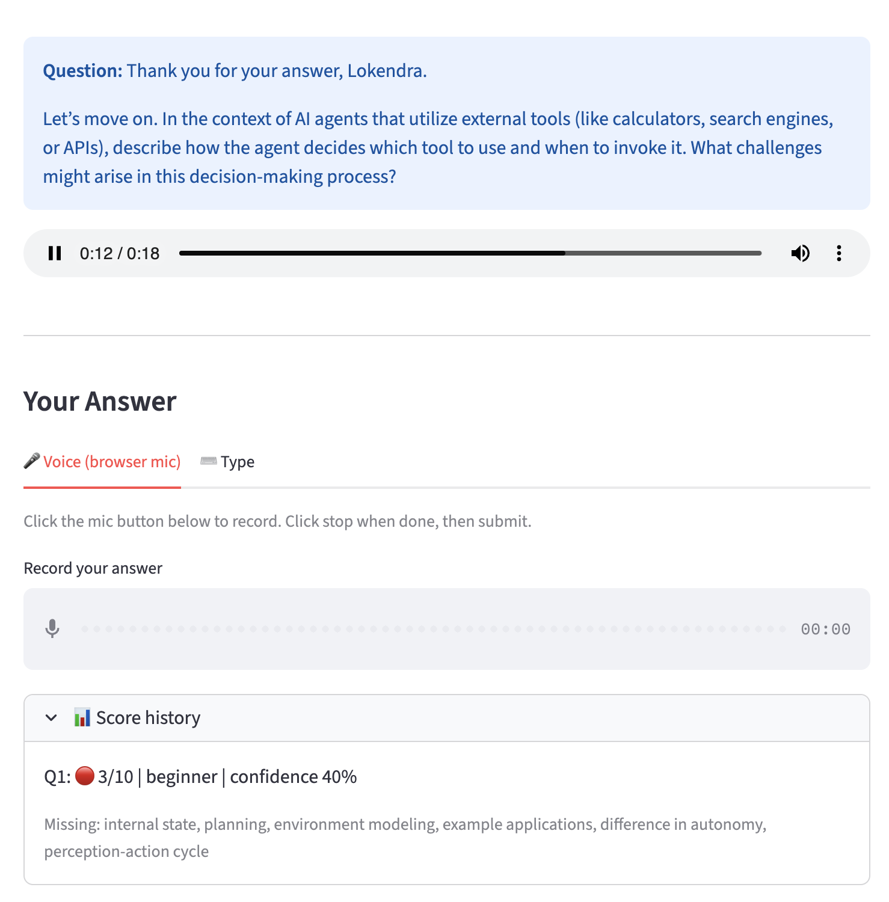

### Report — Full conversation transcript
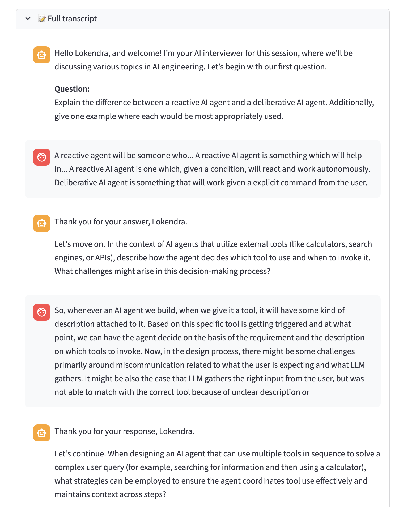

### Report — Per-question evaluations with missing topics
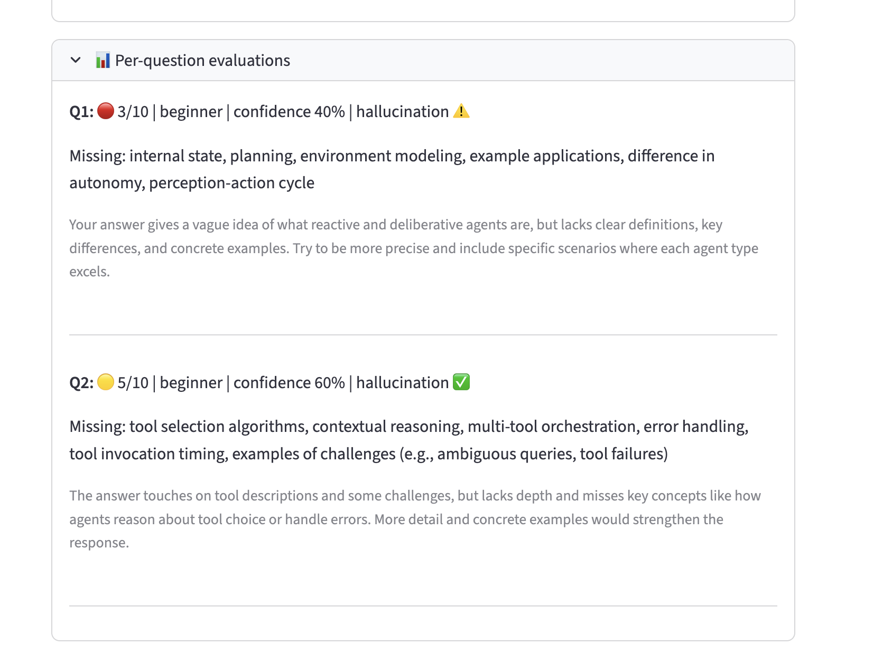

### Report — Interview complete with summary metrics
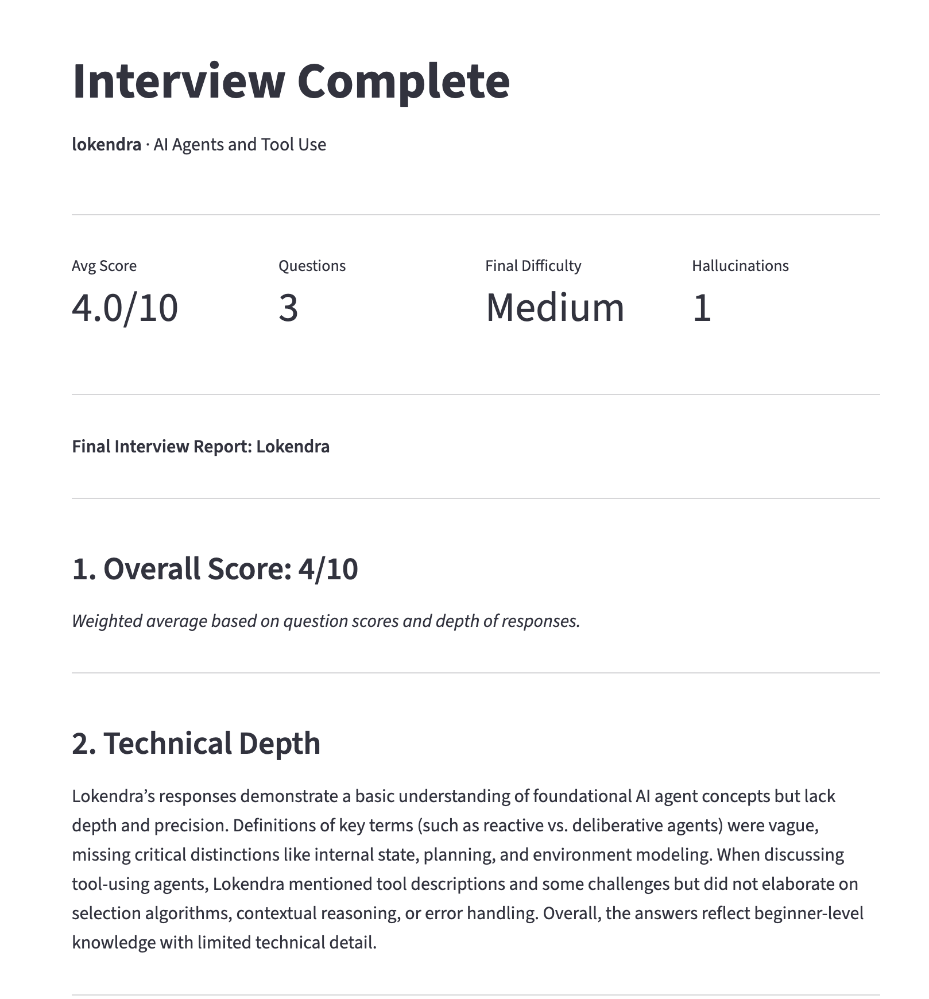

### Report — Communication, Strengths and Gaps
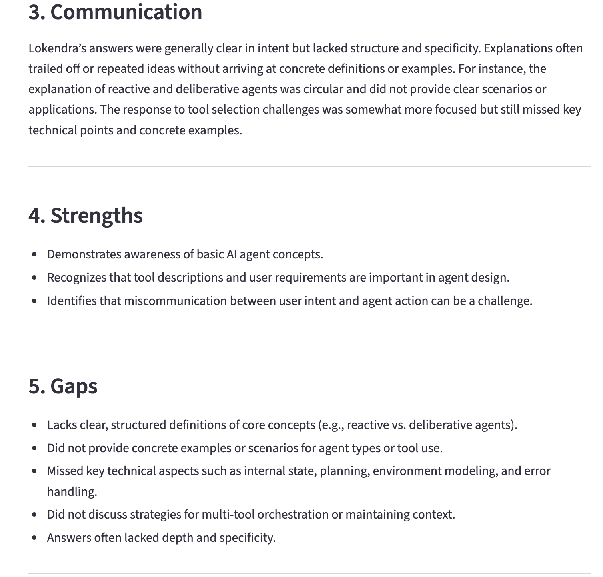

### Report — Hiring signal and recommended study areas
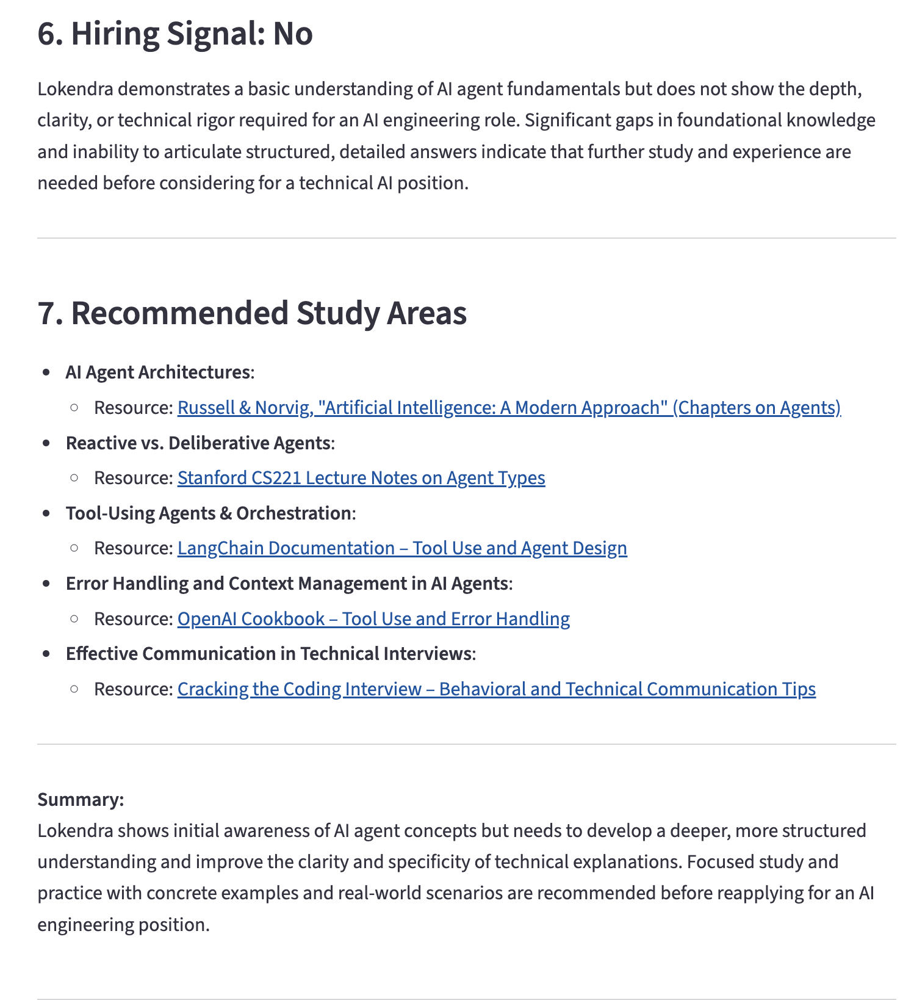

---

## Tech Stack

| Layer | Technology |
|---|---|
| LLM | OpenAI GPT-4.1 |
| TTS | OpenAI `gpt-4o-mini-tts` |
| STT | OpenAI `gpt-4o-mini-transcribe` (Whisper) |
| Orchestration | LangGraph `StateGraph` |
| Observability | LangSmith `@traceable` + `trace()` |
| Frontend | Streamlit |
| API | FastAPI (optional) |
| Package manager | uv |
| Validation | Pydantic v2 |
